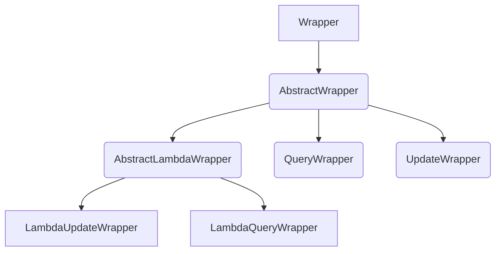

<!--more--->

# MyBatisPlus

## 1、工具

插件：mybatisPlus

依赖  (可以替换掉mybatis的starter)

```xml
<dependency>
    <groupId>com.baomidou</groupId>
    <artifactId>mybatis-plus-boot-starter</artifactId>
    <version>3.5.3.1</version>
</dependency>
```


## 2、快速开始

自定义mapper继承BaseMapper

```java
package com.itheima.mp.mapper;

import com.baomidou.mybatisplus.core.mapper.BaseMapper;
import com.itheima.mp.domain.po.User;

public interface UserMapper extends BaseMapper<User> {
}
```

## 3、常见注解

MybatisPlus就是根据PO实体的信息来推断出表的信息，从而生成SQL的。默认情况下：

- MybatisPlus会把PO实体的类名驼峰转下划线作为表名
- MybatisPlus会把PO实体的所有变量名驼峰转下划线作为表的字段名，并根据变量类型推断字段类型
- MybatisPlus会把名为id的字段作为主键

但很多情况下，默认的实现与实际场景不符，因此MybatisPlus提供了一些注解便于我们声明表信息。

### 1） @TableName

表名注解，标识实体类对应的表

```java
@TableName("user")
public class User {
    private Long id;
    private String name;
}
```

### 2）@TableId

主键注解，标识实体类中的主键字段

`TableId`注解支持两个属性：value  、type (默认：IdType.NONE)

IdType:

这里比较常见的有三种：

- `AUTO`：利用数据库的id自增长
- `INPUT`：手动生成id
- `ASSIGN_ID`：雪花算法生成`Long`类型的全局唯一id，这是默认的ID策略

### 3）@TableField

普通字段注解

一般情况下我们并不需要给字段添加`@TableField`注解，一些特殊情况除外：

- 成员变量名与数据库字段名不一致
- 成员变量是以`isXXX`命名，按照`JavaBean`的规范，`MybatisPlus`识别字段时会把`is`去除，这就导致与数据库不符。
- 成员变量名与数据库一致，但是与数据库的关键字冲突。使用`@TableField`注解给字段名添加转义字符：````

```java
@TableName("user")
public class User {
    @TableId
    private Long id;
    private String name;
    private Integer age;
    @TableField("isMarried")
    private Boolean isMarried;
    @TableField("concat")
    private String concat;
}
```

## 4、条件构造器

除了新增以外，修改、删除、查询的SQL语句都需要指定where条件。因此BaseMapper中提供的相关方法除了以`id`作为`where`条件以外，还支持更加复杂的`where`条件

参数中的`Wrapper`就是条件构造的抽象类，其下有很多默认实现



### 1)QueryWrapper

```java
@Test
void testQueryWrapper() {
    // 1.构建查询条件 where name like "%o%" AND balance >= 1000
    QueryWrapper<User> wrapper = new QueryWrapper<User>()
            .select("id", "username", "info", "balance")
            .like("username", "o")
            .ge("balance", 1000);
    // 2.查询数据
    List<User> users = userMapper.selectList(wrapper);
    users.forEach(System.out::println);
}
```

### 2)UpdateWrapper

```java
@Test
void testUpdateWrapper() {
    List<Long> ids = List.of(1L, 2L, 4L);
    // 1.生成SQL
    UpdateWrapper<User> wrapper = new UpdateWrapper<User>()
            .setSql("balance = balance - 200") // SET balance = balance - 200
            .in("id", ids); // WHERE id in (1, 2, 4)
        // 2.更新，注意第一个参数可以给null，也就是不填更新字段和数据，
    // 而是基于UpdateWrapper中的setSQL来更新
    userMapper.update(null, wrapper);
}
```

### 3)LambdaQueryWrapper

无论是QueryWrapper还是UpdateWrapper在构造条件的时候都需要写死字段名称，会出现字符串`魔法值`。这在编程规范中显然是不推荐的

```java
@Test
void testLambdaQueryWrapper() {
    // 1.构建条件 WHERE username LIKE "%o%" AND balance >= 1000
    QueryWrapper<User> wrapper = new QueryWrapper<>();
    wrapper.lambda()
            .select(User::getId, User::getUsername, User::getInfo, User::getBalance)
            .like(User::getUsername, "o")
            .ge(User::getBalance, 1000);
    // 2.查询
    List<User> users = userMapper.selectList(wrapper);
    users.forEach(System.out::println);
}
```

## 5、自定义SQL

```java
@Test
void testCustomWrapper() {
    // 1.准备自定义查询条件
    List<Long> ids = List.of(1L, 2L, 4L);
    QueryWrapper<User> wrapper = new QueryWrapper<User>().in("id", ids);

    // 2.调用mapper的自定义方法，直接传递Wrapper
    userMapper.deductBalanceByIds(200, wrapper);
}
```

然后在UserMapper中自定义SQL：

```java
public interface UserMapper extends BaseMapper<User> {
    @Select("UPDATE user SET balance = balance - #{money} ${ew.customSqlSegment}")
    void deductBalanceByIds(@Param("money") int money, @Param("ew") QueryWrapper<User> wrapper);
}
```


## 6、Service接口

MybatisPlus不仅提供了BaseMapper，还提供了通用的Service接口及默认实现，封装了一些常用的service模板方法。 通用接口为`IService`，默认实现为`ServiceImpl`，其中封装的方法可以分为以下几类：

- `save`：新增
- `remove`：删除
- `update`：更新
- `get`：查询单个结果
- `list`：查询集合结果
- `count`：计数
- `page`：分页查询

**1）新增**

- `save`是新增单个元素
- `saveBatch`是批量新增
- `saveOrUpdate`是根据id判断，如果数据存在就更新，不存在则新增
- `saveOrUpdateBatch`是批量的新增或修改

**2）删除**

- `removeById`：根据id删除
- `removeByIds`：根据id批量删除
- `removeByMap`：根据Map中的键值对为条件删除
- `remove(Wrapper<T>)`：根据Wrapper条件删除
- `~~removeBatchByIds~~`：暂不支持

**3）修改**

- `updateById`：根据id修改
- `update(Wrapper<T>)`：根据`UpdateWrapper`修改，`Wrapper`中包含`set`和`where`部分
- `update(T，Wrapper<T>)`：按照`T`内的数据修改与`Wrapper`匹配到的数据
- `updateBatchById`：根据id批量修改

**4）Get**

- `getById`：根据id查询1条数据
- `getOne(Wrapper<T>)`：根据`Wrapper`查询1条数据
- `getBaseMapper`：获取`Service`内的`BaseMapper`实现，某些时候需要直接调用`Mapper`内的自定义`SQL`时可以用这个方法获取到`Mapper`

**5)List**

- `listByIds`：根据id批量查询
- `list(Wrapper<T>)`：根据Wrapper条件查询多条数据
- `list()`：查询所有

**6)Count**

- `count()`：统计所有数量
- `count(Wrapper<T>)`：统计符合`Wrapper`条件的数据数量


#### **用法**

由于`Service`中经常需要定义与业务有关的自定义方法，因此我们不能直接使用`IService`，而是自定义`Service`接口，然后继承`IService`以拓展方法。同时，让自定义的`Service实现类`继承`ServiceImpl`，这样就不用自己实现`IService`中的接口了。

首先，定义`IUserService`，继承`IService`：

```java
public interface IUserService extends IService<User> {
    // 拓展自定义方法
}
```

然后，编写`UserServiceImpl`类，继承`ServiceImpl`，实现`UserService`

```java
@Service
public class UserServiceImpl extends ServiceImpl<UserMapper, User> implements IUserService 
{
}
```


#### **基于Lambda查询**

```java
    List<User> users = userService.lambdaQuery()
            .like(username != null, User::getUsername, username)
            .eq(status != null, User::getStatus, status)
            .ge(minBalance != null, User::getBalance, minBalance)
            .le(maxBalance != null, User::getBalance, maxBalance)
            .list();
```

与lambdaQuery方法类似，IService中的lambdaUpdate方法可以非常方便的实现复杂更新业务


#### **MySQL批量新增**

修改项目中的application.yml文件，在jdbc的url后面添加参数`&rewriteBatchedStatements=true`

```yml
spring:
  datasource:
    url: jdbc:mysql://127.0.0.1:3306/mp?useUnicode=true&characterEncoding=UTF-8&autoReconnect=true&serverTimezone=Asia/Shanghai&rewriteBatchedStatements=true
    driver-class-name: com.mysql.cj.jdbc.Driver
    username: root
    password: 1234
```

## 7、静态工具

有的时候Service之间也会相互调用，为了避免出现循环依赖问题，MybatisPlus提供一个静态工具类：`Db`，其中的一些静态方法与`IService`中方法签名基本一致，也可以帮助我们实现CRUD功能：

```java
@Test
void testDbGet() {
    User user = Db.getById(1L, User.class);
    System.out.println(user);
}

@Test
void testDbList() {
    // 利用Db实现复杂条件查询
    List<User> list = Db.lambdaQuery(User.class)
            .like(User::getUsername, "o")
            .ge(User::getBalance, 1000)
            .list();
    list.forEach(System.out::println);
}

@Test
void testDbUpdate() {
    Db.lambdaUpdate(User.class)
            .set(User::getBalance, 2000)
            .eq(User::getUsername, "Rose");
}
```

## 8、逻辑删除

对于一些比较重要的数据，我们往往会采用逻辑删除的方案，即：

- 在表中添加一个字段标记数据是否被删除
- 当删除数据时把标记置为true
- 查询时过滤掉标记为true的数据

一旦采用了逻辑删除，所有的查询和删除逻辑都要跟着变化，非常麻烦。

> **注意**，只有MybatisPlus生成的SQL语句才支持自动的逻辑删除，自定义SQL需要自己手动处理逻辑删除。


先给`address`表添加一个逻辑删除字段

然后给`Address`实体添加`deleted`字段：

接下来，我们要在`application.yml`中配置逻辑删除字段

```yml
mybatis-plus:
  global-config:
    db-config:
      logic-delete-field: deleted # 全局逻辑删除的实体字段名(since 3.3.0,配置后可以忽略不配置步骤2)
      logic-delete-value: 1 # 逻辑已删除值(默认为 1)
      logic-not-delete-value: 0 # 逻辑未删除值(默认为 0)
```

> **注意**： 逻辑删除本身也有自己的问题，比如：
>
> - 会导致数据库表垃圾数据越来越多，从而影响查询效率
> - SQL中全都需要对逻辑删除字段做判断，影响查询效率
>
> 因此，我不太推荐采用逻辑删除功能，如果数据不能删除，可以采用把数据迁移到其它表的办法。


## 9、通用枚举

User类中字段 status 

像这种字段我们一般会定义一个枚举，做业务判断的时候就可以直接基于枚举做比较。但是我们数据库采用的是`int`类型，对应的PO也是`Integer`。因此业务操作时必须手动把`枚举`与`Integer`转换，非常麻烦。

因此，MybatisPlus提供了一个处理枚举的类型转换器，可以帮我们**把枚举类型与数据库类型自动转换**。

示例：

```java
package com.itheima.mp.enums;

import com.baomidou.mybatisplus.annotation.EnumValue;
import lombok.Getter;

@Getter
public enum UserStatus {
    NORMAL(1, "正常"),
    FREEZE(2, "冻结")
    ;
    @EnumValue
    private final int value;
    @JsonValue
    private final String desc;

    UserStatus(int value, String desc) {
        this.value = value;
        this.desc = desc;
    }
}
```

然后把`User`类中的`status`字段改为`UserStatus` 类型：

```java
private UserStatus status;
```

要让`MybatisPlus`处理枚举与数据库类型自动转换，我们必须告诉`MybatisPlus`，枚举中的哪个字段的值作为数据库值。 `MybatisPlus`提供了`@EnumValue`注解来标记枚举属性。 在UserStatus枚举中通过`@JsonValue`注解标记JSON序列化时展示的字段

**配置枚举处理器**

```YAML
mybatis-plus:
  configuration:
    default-enum-type-handler: com.baomidou.mybatisplus.core.handlers.MybatisEnumTypeHandler
```


## 10、JSON处理器

数据库的user表中有一个`info`字段，是JSON类型，而目前`User`实体类中却是`String`类型

这样一来，我们要读取info中的属性时就非常不方便。如果要方便获取，info的类型最好是一个`Map`或者实体类。

而一旦我们把`info`改为`对象`类型，就需要在写入数据库时手动转为`String`，再读取数据库时，手动转换为`对象`，这会非常麻烦。

因此MybatisPlus提供了很多特殊类型字段的类型处理器，解决特殊字段类型与数据库类型转换的问题。例如处理JSON就可以使用`JacksonTypeHandler`处理器。


首先定义一个单独实体类来与info字段的属性匹配，接下来，将User类的info字段修改为UserInfo类型，并声明类型处理器

```java
@TableField(typeHandlee = JacksonTypeHandler.class)
private UserIbnfo info;
```


## 11、分页

在未引入分页插件的情况下，`MybatisPlus`是不支持分页功能的，`IService`和`BaseMapper`中的分页方法都无法正常起效。 所以，我们必须配置分页插件。

### 1）**配置分页插件**

新建一个配置类：

```java
package com.itheima.mp.config;

import com.baomidou.mybatisplus.annotation.DbType;
import com.baomidou.mybatisplus.extension.plugins.MybatisPlusInterceptor;
import com.baomidou.mybatisplus.extension.plugins.inner.PaginationInnerInterceptor;
import org.springframework.context.annotation.Bean;
import org.springframework.context.annotation.Configuration;

@Configuration
public class MybatisConfig {

    @Bean
    public MybatisPlusInterceptor mybatisPlusInterceptor() {
        // 初始化核心插件
        MybatisPlusInterceptor interceptor = new MybatisPlusInterceptor();
        // 添加分页插件
        interceptor.addInnerInterceptor(new PaginationInnerInterceptor(DbType.MYSQL));
        return interceptor;
    }
}
```

### 2)**分页**API

```java
@Test
void testPageQuery() {
    // 1.分页查询，new Page()的两个参数分别是：页码、每页大小
    Page<User> p = userService.page(new Page<>(2, 2));
    // 2.总条数
    System.out.println("total = " + p.getTotal());
    // 3.总页数
    System.out.println("pages = " + p.getPages());
    // 4.数据
    List<User> records = p.getRecords();
    records.forEach(System.out::println);
}
```

这里用到了分页参数，Page，即可以支持分页参数，也可以支持排序参数。常见的API如下

```java
int pageNo = 1, pageSize = 5;
// 分页参数
Page<User> page = Page.of(pageNo, pageSize);
// 排序参数, 通过OrderItem来指定
page.addOrder(new OrderItem("balance", false));

userService.page(page);
```

